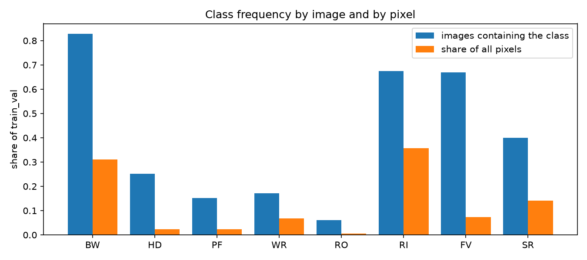
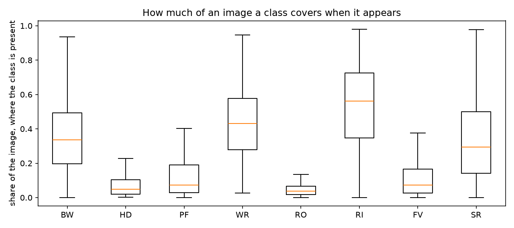
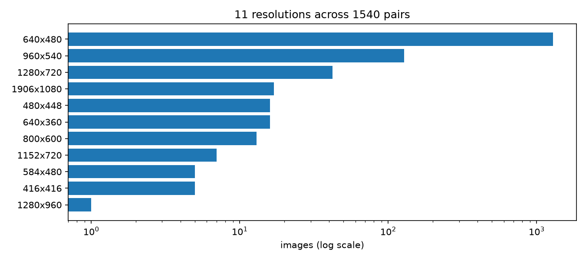

# Assignment 2 - M1 Dataset Proposal

## 1. Group and proposed task

- **Group name:** Placeholder
- **Members:**

| Full name        | Student ID |
| ---------------- | ---------- |
| Vu Duc Viet Anh  | 2352074    |
| Tran Lam Anh     | 2352067    |
| Le Nguyen Khang  | 2352470    |
| Tran Nguyen Giap | 2352284    |

- **Task track:** Semantic segmentation.
- **Problem statement:** The task assigns each pixel in an underwater RGB image to one of eight categories. This output could help an autonomous underwater vehicle distinguish divers, robots, reefs, wrecks, plants, fish, sea floor and open water.
- **Input:** An underwater RGB photograph.
- **Output and labels:** One dense mask with eight mutually exclusive classes. The label definitions and RGB colour codes follow the [official SUIM dataset page](https://irvlab.cs.umn.edu/resources/suim-dataset):

| Object category | Symbol | RGB color code |
| --- | --- | --- |
| Background (waterbody) | BW | 000 (black) |
| Human divers | HD | 001 (blue) |
| Aquatic plants and sea-grass | PF | 010 (green) |
| Wrecks and ruins | WR | 011 (sky) |
| Robots (AUVs/ROVs/instruments) | RO | 100 (red) |
| Reefs and invertebrates | RI | 101 (pink) |
| Fish and vertebrates | FV | 110 (yellow) |
| Sea-floor and rocks | SR | 111 (white) |

- **Suitability:** The dataset contains 1,540 usable image and mask pairs and seven foreground classes. It therefore exceeds the handbook's default segmentation thresholds. Its class imbalance and underwater image degradation also make the planned comparison between a model trained from scratch and a pretrained model relevant.

## 2. Dataset identity and access

- **Dataset name:** SUIM, Segmentation of Underwater IMagery, introduced by Islam et al. in "Semantic Segmentation of Underwater Imagery: Dataset and Benchmark", IROS 2020, arXiv:2004.01241.
- **Source and download URL:** https://irvlab.cs.umn.edu/resources/suim-dataset.
- **Version and access date:** Neither the paper nor the archive's `INFO.txt` specifies a version. The dataset was downloaded on 02 Oct 2026.
- **License and permitted use:** The [authors' code repository](https://github.com/xahidbuffon/SUIM/blob/master/LICENSE) uses the MIT license for its software. The [dataset page](https://irvlab.cs.umn.edu/resources/suim-dataset) does not state a separate license for the image and mask archive. This proposal therefore does not assume that the software license governs redistribution of the dataset. The group will use the archive for this course project and cite its source, while keeping the dataset out of the repository.
- **Data format and size:** Images are JPEG and masks are 24-bit BMP, paired by filename stem. The archive provides 1,525 `train_val/` pairs and 110 `TEST/` pairs. The project uses approximately 2.2 GB of data.
- **Limitations:** Images include material from EUVP, USR-248 and UFO-120. Classes are imbalanced, and image sizes vary, so results may be sensitive to source overlap and resizing.

## 3. Dataset size and preliminary analysis

- **Total samples:** The dataset contains 1,635 image and mask pairs, with 1,525 in `train_val/` and 110 in `TEST/`. These counts come from matching filename stems in each split's `images/` and `masks/` directories. Every image has a corresponding mask, and every mask has a corresponding image. The totals agree with `INFO.txt` and the paper.
- **Proposed usable samples:** The proposed analysis uses 1,540 pairs, including 1,430 from `train_val/` and all 110 from `TEST/`. Every file decodes. Two exclusion rules remove 95 pairs from `train_val/`. The first removes 85 masks whose colours shifted after JPEG processing. Because mask colour encodes class identity, these shifts can change labels systematically. In these masks, 97 percent of pixels labelled as robot border a reef pixel, compared with 0 percent in clean masks. The 85 masks also include all pairs in which the mask is taller than its image. The second rule removes 10 images that are identical or near-identical to a `TEST` image. Their inclusion in training could inflate the test score. The official `TEST` split remains intact for benchmark comparability.
- **Annotations:** Each image has one dense eight-class mask with no void label. The 1,540 usable masks contain 559,013,360 labelled pixels.
- **Class distribution:** RI accounts for 35.64 percent of usable `train_val/` pixels, compared with 0.56 percent for RO. RI falls to 19.47 percent in `TEST/`. The full per-class pixel distribution is in Appendix A.
- **Input sizes:** The usable pairs contain 11 resolutions, from 416x416 to 1906x1080. About 84 percent are 640x480. All models will use the same resize rule. The resolution distribution is shown in Appendix A.
- **Quality and duplication:** We exclude 85 invalid-colour masks and ten `train_val/` images duplicated in the official `TEST/` split. The full audit is in Appendix B. Excluding shifted masks also removes some valid rare-class examples, which limits interpretation of RO performance.
- **Evidence and threshold:** `scripts/eda/run_suim.py` writes the audit and plots to `results/a2/eda/suim/`, including counts and duplicate filenames in `summary.json`. With seven foreground classes, 1,540 usable masks, and the per-class pixel analysis above, SUIM meets the handbook's default segmentation requirements without an exception.

## 4. Split and leakage prevention

- **Train, validation and test split:** The archive provides `train_val/` and an official `TEST/` split, but no validation split. The proposed protocol preserves all 110 official test pairs for benchmark comparability. It divides the usable `train_val/` pairs into training and validation sets at approximately 80 to 20 percent.
- **Expected sample counts per split:**

| Split      | Pairs | Where it comes from             |
| ---------- | ----- | ------------------------------- |
| train      | 1,143 | folds 1 to 4 of `train_val`     |
| validation | 287   | fold 0 of `train_val`           |
| test       | 110   | `TEST/` as published, untouched |
| total      | 1,540 | the usable pairs of section 3   |

  The observed ratio is 79.9 to 20.1 percent because groups of different sizes are assigned as units.
- **Split unit:** Confirmed duplicate groups, rather than individual images, define the split unit. The 1,430 usable `train_val/` images form 1,370 groups. Group composition and the reason for not using filename prefixes appear in Appendix B.
- **Leakage prevention and stratification:** Duplicate groups stay intact across train and validation. Each image is stratified by its rarest present class. The resulting split contains 69 RO images in training and 17 in validation, and all eight classes appear in both subsets.
- **Reproducible split:** `StratifiedGroupKFold(n_splits=5, shuffle=True, random_state=42)` assigns fold 0 to validation. Committed files `results/a2/splits/suim/train.txt` and `val.txt` fix membership for training.
- **Test-set isolation plan:** The dataset audit inspected `TEST/` images and masks to establish data quality, class distributions and cross-split duplicates. No test labels or model results will be used for hyperparameter tuning, early stopping, checkpoint selection or threshold selection. All 110 official test pairs pass the stated quality checks and remain in the benchmark. After configurations are selected on validation, each selected model will be evaluated once on `TEST/`, without iterating on its predictions.
- **Subset selection rules:** The proposal removes only the 85 `train_val/` pairs that fail the mask-quality rule and the ten `train_val/` images that duplicate `TEST/`. It retains all 1,143 training, 287 validation and 110 test pairs after these exclusions. No retained image is subsampled or repeated. Class imbalance is not addressed through resampling. Any loss weighting would be a model-side decision.

## 5. Evaluation plan

- **Metrics:** We will accumulate confusion counts across each evaluation split, then report mean IoU and mean Dice over all eight classes, plus per-class IoU. Equal class weighting makes rare-class performance visible.
- **Qualitative and error analysis:** We will show input images, ground truth and predictions for high-scoring and low-scoring validation examples and RO-containing examples. A pixel confusion matrix and boundary-versus-interior IoU will characterize class confusion and localization errors.
- **Selection:** Validation mIoU and rare-class IoU will guide model selection. The official test split will be evaluated only after configurations are fixed.

## 6. Model and experiment plan

- **Simple baselines:** Two baselines serve different purposes
  1. A constant RI predictor checks the metric implementation.
  2. A U-Net with base width 32 and approximately 7.8 million parameters will be trained from scratch. It is the learned baseline for comparison with the pretrained model.
- **Pretrained model:** `torchvision.models.segmentation.deeplabv3_resnet50` with `DeepLabV3_ResNet50_Weights.COCO_WITH_VOC_LABELS_V1`. We will replace its classifier with an eight-class head. If it cannot fit in 4 GB of video memory, the fallback is pretrained `lraspp_mobilenet_v3_large`.
- **Fine-tuning:** Both models will use the fixed split, 320x240 inputs, identical resizing and horizontal-flip augmentation, AdamW, and a 40-epoch schedule. DeepLabV3 will use a lower learning rate for its pretrained backbone than for its new head. Full settings are in Appendix C. The U-Net versus DeepLabV3 comparison changes both architecture and pretraining; only the loss experiment below isolates one factor.
- **Controlled experiment:** With DeepLabV3 and all other settings fixed, we will compare cross-entropy against `0.5 × cross-entropy + 0.5 × class-averaged soft Dice`. We hypothesize that the Dice term improves rare-class IoU without reducing overall mIoU. Validation mIoU and RO, PF and WR IoU will assess this hypothesis.

## 7. Compute and reproducibility estimate

- **Hardware:** We train on Kaggle T4 GPU.
- **Time estimate:** Three 40-epoch runs, comprising U-Net and two DeepLabV3 loss arms, are provisionally estimated at six GPU hours. GPU time has not been measured, short CPU benchmarks and assumptions are in Appendix D. We will replace this estimate with measured timings in M2.
- **Storage and reproducibility:** SUIM uses about 2.2 GB, new outputs are expected to remain below 1 GB. Seed 42 controls initialization, shuffling and augmentation, while committed split files fix membership. We will select the checkpoint with highest validation mIoU. Dependencies are recorded in `pyproject.toml` and `uv.lock`.
- **Feasibility:** If memory or time is insufficient, the fallbacks in Appendix D preserve the same dataset, task, and controlled comparison. We will follow any conditions imposed during approval.

---
## Appendix A. Class definitions and distribution

The authors encode BW, HD, PF, WR, RO, RI, FV, and SR as three-bit RGB colours 000, 001, 010, 011, 100, 101, 110, and 111, respectively. The binary value gives the class index. Image count measures class occurrence, pixel share measures dataset coverage, and area when present measures typical region size.

| Class | `train_val` images | Pixel share | Image area when present | `TEST` images | `TEST` pixel share |
| --- | ---: | ---: | ---: | ---: | ---: |
| BW background waterbody | 1,185 (82.9%) | 30.99% | 33.6% | 95 (86.4%) | 41.81% |
| HD human divers | 359 (25.1%) | 2.34% | 4.9% | 42 (38.2%) | 3.69% |
| PF plants and sea-grass | 218 (15.2%) | 2.29% | 7.4% | 20 (18.2%) | 3.08% |
| WR wrecks or ruins | 245 (17.1%) | 6.77% | 43.2% | 27 (24.5%) | 7.28% |
| RO robots and instruments | 86 (6.0%) | 0.56% | 3.8% | 12 (10.9%) | 0.90% |
| RI reefs and invertebrates | 964 (67.4%) | 35.64% | 56.1% | 58 (52.7%) | 19.47% |
| FV fish and vertebrates | 958 (67.0%) | 7.26% | 7.2% | 66 (60.0%) | 6.77% |
| SR sand, sea-floor and rocks | 571 (39.9%) | 14.15% | 29.5% | 60 (54.5%) | 17.00% |

The first figure compares class frequency by image and by pixel. The second shows how much area each class occupies when present.

The image-resolution distribution supports the common 320x240 training size while showing the less frequent original sizes.

## Appendix B. Data-quality audit and split details

| Audit finding                                    |                   Count | Check                                            |
| ------------------------------------------------ | ----------------------: | ------------------------------------------------ |
| Missing image or mask                            |                       0 | Paired filename stems                            |
| File that fails to decode                        |                       0 | Full image and mask decode                       |
| Mask 55 rows taller than image                   |                      37 | Paired dimensions; subset of invalid masks below |
| Mask colours outside eight class codes           |                      85 | Exact mask-pixel colour check                    |
| Duplicate images within `train_val/`             | 115 images in 55 groups | Hash candidates, then pixel confirmation         |
| Duplicate images across `train_val/` and `TEST/` |    10 groups, 20 images | Same procedure                                   |

The 1,430 usable `train_val/` images form 1,315 singleton groups and 55 multi-image groups. The latter contain 51 pairs, three triples, and one group of four. Filename prefixes are unsuitable as split units because only four exist and `f_r` covers 929 images. The group-aware split keeps confirmed duplicates together. `scripts/eda/run_suim.py` records group filenames and audit results in `results/a2/eda/suim/summary.json`.

## Appendix C. Planned training settings

| Setting       | Plan                                               | Reason                                      |
| ------------- | -------------------------------------------------- | ------------------------------------------- |
| Input size    | 320x240                                            | Matches the dominant 4:3 aspect ratio       |
| Resampling    | Bilinear images; nearest-neighbour masks           | Preserves discrete class labels             |
| Normalization | ImageNet mean and standard deviation               | Matches pretrained checkpoint preprocessing |
| Augmentation  | Random horizontal flip                             | Preserves vertical scene orientation        |
| Loss          | Eight-class cross-entropy; no `ignore_index`       | No void label exists                        |
| Optimizer     | AdamW; head 1e-3, backbone 1e-4; weight decay 1e-4 | Smaller updates for pretrained backbone     |
| Schedule      | Five warm-up epochs, then cosine; 40 epochs total  | Fits provisional compute budget             |
| Batch         | Four with accumulation of four; effective batch 16 | Fits limited GPU memory                     |

U-Net will share the data processing and schedule, but use one learning rate of 1e-3 because it has no pretrained backbone.

## Appendix D. Compute evidence and fallback plan

Short CPU benchmarks at 320x240 and batch size four imply 286 training steps per epoch for 1,143 training images. These measurements are approximate and do not establish GPU runtime.

| Model | CPU step | Estimated CPU epoch |
| --- | ---: | ---: |
| U-Net base 32 | 8.56 s | 40.8 min |
| DeepLabV3-ResNet50 | 17.64 s | 84.1 min |
| LR-ASPP MobileNetV3-Large | 1.76 s | 8.4 min |

| Risk | Fallback |
| --- | --- |
| DeepLabV3 exceeds 4 GB | Reduce physical batch from four to two and increase accumulation from four to eight. If needed, reduce input size to 256x192, then use pretrained LR-ASPP. |
| CUDA cannot run on the local GPU | Use the same code and split files on a free Colab or Kaggle T4. |
| Forty epochs exceed the M2 deadline | Reduce every compared run to 25 epochs and rescale the schedule, keeping the loss comparison controlled. |
